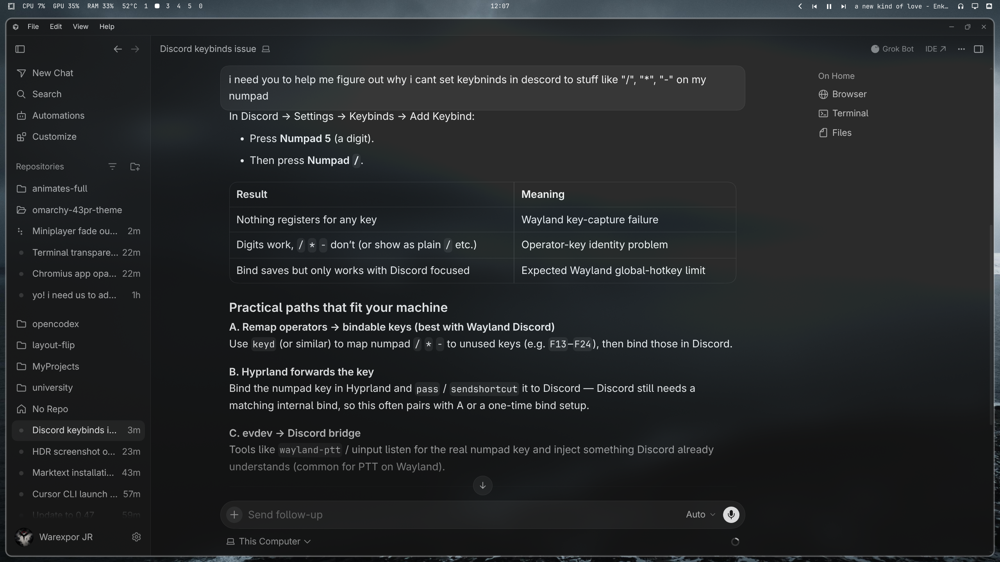

# Omarchy 43PR

Pure black monochrome Omarchy theme adapted from [43PR/dotfiles](https://github.com/43PR/dotfiles) — their noctalia kitty palette, translucent bar, and silver/white chrome.



## Install

```bash
omarchy theme install https://github.com/Warexpor/omarchy-43pr-theme.git
```

That clones into `~/.config/omarchy/themes/43pr` and applies it. No hooks, plugins, or desktop mutations beyond what Omarchy's theme install already does.

## What you get

- Near-black UI with grayscale ANSI colors (from their noctalia theme)
- Translucent bar (`#141414` @ 50% alpha), white type
- White/silver active borders via `colors.toml`
- Their wallpaper set under `backgrounds/`
- Lock tokens tuned toward their hyprlock white gradients

## Optional extras

`omarchy theme install` regenerates executable theme files (`*.lua`, terminal configs) from `colors.toml`. Hand-copied `hyprland.lua` / `neovim.lua` in this repo are reference only.

Blurred Chromium windows, Foot TUI blur, HDR SDR launch flags, and transparent agent TUIs cannot ship inside a git-installed theme. They live under **[extras/](extras/README.md)** and are **opt-in**:

```bash
./extras/install-hdr-blur.sh              # chromium-sdr-sync only
./extras/install-hdr-blur.sh --with-hooks # + Omarchy post-update/post-boot
./extras/install-tui-agents.sh            # apply TUI templates once
./extras/install-tui-agents.sh --with-hooks
```

Then paste the Hyprland / Foot snippets `install-hdr-blur.sh` points at (also in `extras/looknfeel-blur.lua`).

## HDR notes

Battle-tested notes from running this theme on a real HDR panel:

**[docs/hdr-on-omarchy.md](docs/hdr-on-omarchy.md)**

## Machine restore (same box)

This repo is also the remote backup for **this** Omarchy machine (Hyprland HDR, proxies, app wrappers, plugins, package lists). Configs and scripts only — no personal media or secrets.

Agent playbook: **[system/RESTORE.md](system/RESTORE.md)**

```bash
./system/restore.sh --dry-run    # preview
./system/restore.sh              # apply (prompts for packages)
```

## Credits

- Visual language and wallpapers: [43PR/dotfiles](https://github.com/43PR/dotfiles)
- Wallpapers also listed at https://wallhaven.cc/user/43pr
- Built for [Omarchy](https://omarchy.org/)

## License

[MIT](LICENSE)
