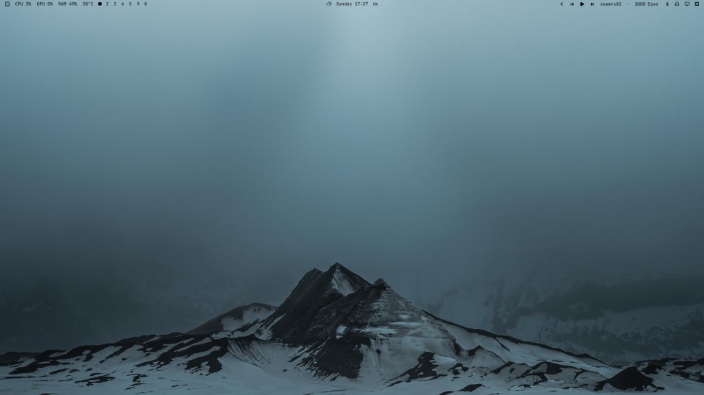
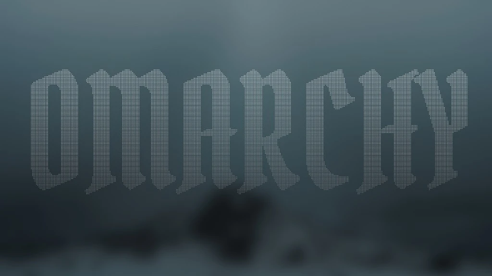
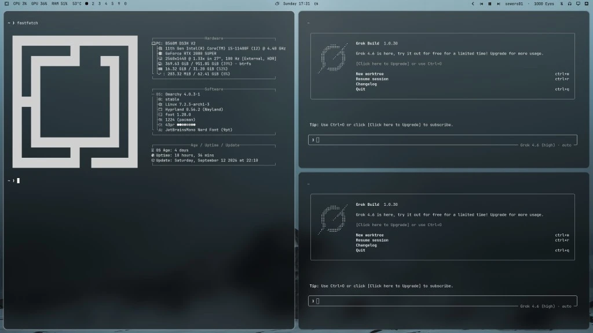

# Omarchy 43PR

Pure black monochrome Omarchy theme adapted from [43PR/dotfiles](https://github.com/43PR/dotfiles) — their noctalia kitty palette, translucent bar, and silver/white chrome.



## Install the theme

```bash
omarchy theme install https://github.com/Warexpor/omarchy-43pr-theme.git
```

That clones into `~/.config/omarchy/themes/43pr` and applies it. No hooks, plugins, or desktop mutations beyond what Omarchy's theme install already does.

## Install the complete desktop look

After installing the theme, run the setup from its clone:

```bash
~/.config/omarchy/themes/43pr/install-desktop.sh
```

The setup asks once before changing anything, then installs the five public
Omarchy shell plugins, applies the matching bar layout, and installs the
frosted monochrome screensaver. It backs up every replaced shell section and
file under `~/.local/state/omarchy-43pr/`.

It deliberately does **not** install packages, proxy settings, HDR overrides,
systemd units, udev rules, or the machine restore.

Undo the visual setup without removing the theme:

```bash
~/.config/omarchy/themes/43pr/uninstall-desktop.sh
```

The plugin sources are independently installable and reviewable:

- [Adaptive ink bar](https://github.com/Warexpor/omarchy-43pr-adaptive-bar-plugin)
- [Idle and screensaver service](https://github.com/Warexpor/omarchy-43pr-idle-plugin)
- [Image picker](https://github.com/Warexpor/omarchy-43pr-image-picker-plugin)
- [Media controls](https://github.com/Warexpor/omarchy-43pr-media-plugin)
- [Display controls](https://github.com/Warexpor/omarchy-43pr-monitor-plugin)

## What you get

- Near-black UI with grayscale ANSI colors (from their noctalia theme)
- Translucent bar (`#141414` @ 50% alpha), white type
- White/silver active borders via `colors.toml`
- Their wallpaper set under `backgrounds/`
- Lock tokens tuned toward their hyprlock white gradients

## Showcase

### Frosted screensaver



### Tiled windows



## Optional extras

`omarchy theme install` regenerates executable theme files (`*.lua`, terminal configs) from `colors.toml`. Hand-copied `hyprland.lua` / `neovim.lua` in this repo are reference only.

Blurred Chromium windows, Foot TUI blur, HDR SDR launch flags, and transparent agent TUIs cannot ship inside a git-installed theme. They live under **[extras/](extras/README.md)** and are **opt-in**:

```bash
./extras/install-hdr-blur.sh              # chromium-sdr-sync only
./extras/install-hdr-blur.sh --with-hooks # + Omarchy post-update/post-boot
./extras/install-tui-agents.sh            # apply TUI templates once
./extras/install-tui-agents.sh --with-hooks
```

Then paste the Hyprland / Foot snippets `install-hdr-blur.sh` points at (also in `extras/looknfeel-blur.lua`).

## HDR notes

Battle-tested notes from running this theme on a real HDR panel:

**[docs/hdr-on-omarchy.md](docs/hdr-on-omarchy.md)**

Includes Chromium/Electron SDR launch flags, Foot blur, and **screen
recording on HDR** (desktop stays in `cm=hdr`; GSR output is washed — grade
in an editor). Wrappers + Capture-menu overrides live under `system/` for
restore.

## Machine restore

This repo also holds a **generic** Omarchy machine restore under `system/`
(Hyprland HDR example, wrappers, plugins, empty package stubs). Configs and
scripts only — no personal media, secrets, or machine fingerprint.

Agent playbook: **[system/RESTORE.md](system/RESTORE.md)**

Private same-box manifests (packages, proxy hostname, OpenRGB device name)
live outside git, e.g. `~/.local/share/omarchy-43pr-private-backup/`.

```bash
./system/restore.sh --dry-run    # preview
./system/restore.sh              # apply (prompts for packages)
```

## Credits

- Visual language and wallpapers: [43PR/dotfiles](https://github.com/43PR/dotfiles)
- Wallpapers also listed at https://wallhaven.cc/user/43pr
- Built for [Omarchy](https://omarchy.org/)

## License

[MIT](LICENSE)
